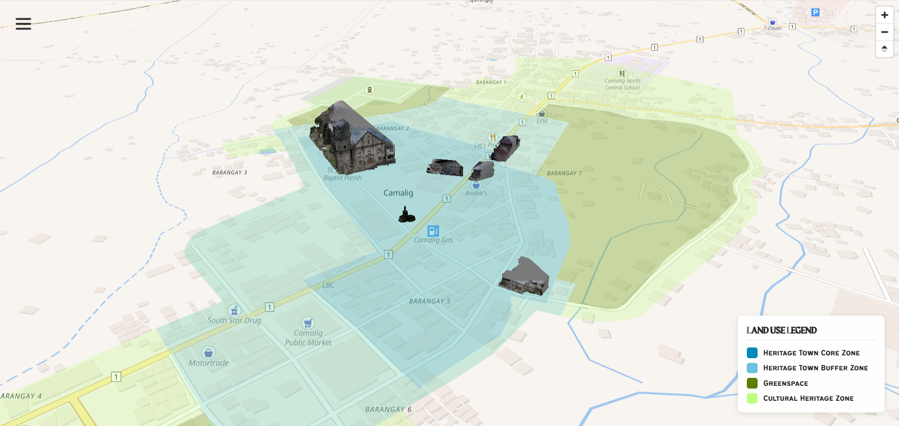
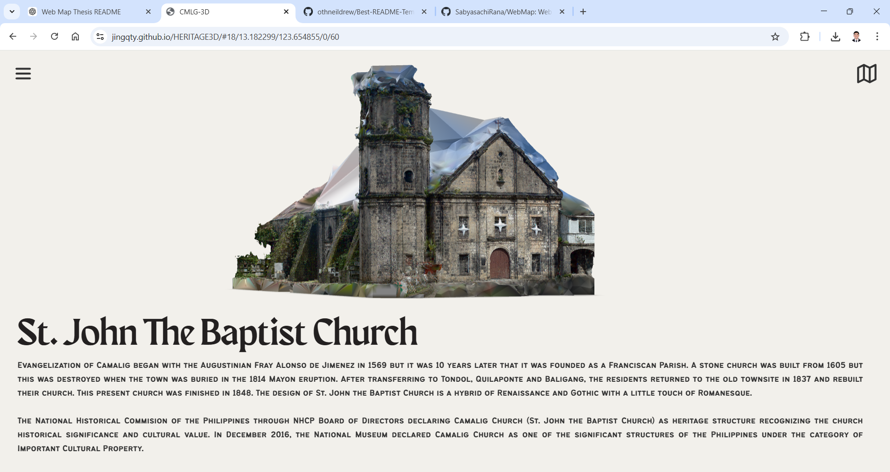

# HERITAGE3D
🔗 **Live Project:** https://jingqty.github.io/HERITAGE3D

A Geovisualization Of The Cultural And Historical  Tangible Assets In The Heritage Zone Of Camalig, Albay 

---

## Screenshots

---

## About the Project

**HERITAGE3D** is an interactive web map that visualizes the geospatial location, historical significance, and 3D exterior facades of cultural and historical tangible assets such as ancestral houses, churches, and landmarks in the heritage zone of Camalig, Albay.

This project was our undergraduate thesis to digitally document and present local cultural heritage through a web-based mapping platform. **A huge shoutout to my thes-sheesh buddies, Engr.Nadine and Engr.Leo for the teamwork, ideas, and late nights that helped make this possible.**

---

## Built With

The system was built using the following workflow:

**Mapping Framework:** MapLibre GL JS 

**Base Map Data:** OpenStreetMap 

**3D Model Creation:** RealityCapture 

**3D Web Graphics:** Three.JS  
                    ModelViewer 

The system integrates spatial data from OpenStreetMap into a 3D web map built with MapLibre GL JS. Cultural heritage structures were documented through onsite surveys, where exterior facade images were captured using a digital camera. These images were processed in RealityCapture to generate detailed 3D models. The models were then georeferenced and positioned within the web-based map to accurately represent their real-world locations.

---

## Why

The project aims to provide an accessible and interactive platform for documenting, preserving, and promoting cultural heritage. By combining GIS, photogrammetry, and web mapping, the system supports digital heritage preservation and helps increase public awareness of historically significant structures.

---

## License

This project is licensed under the MIT License. See the `LICENSE` file for more information.
